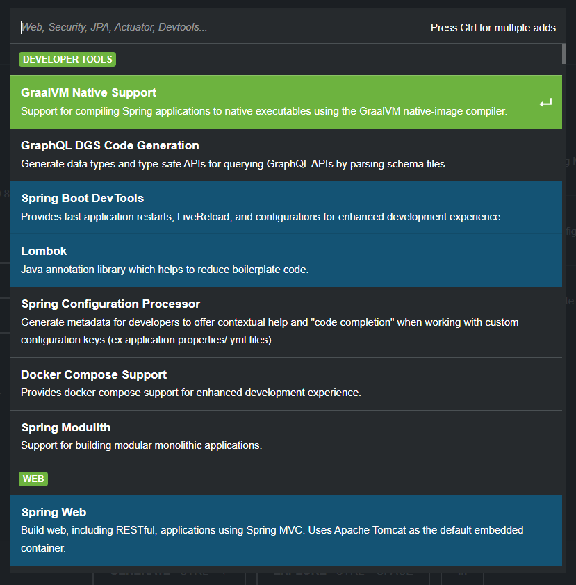
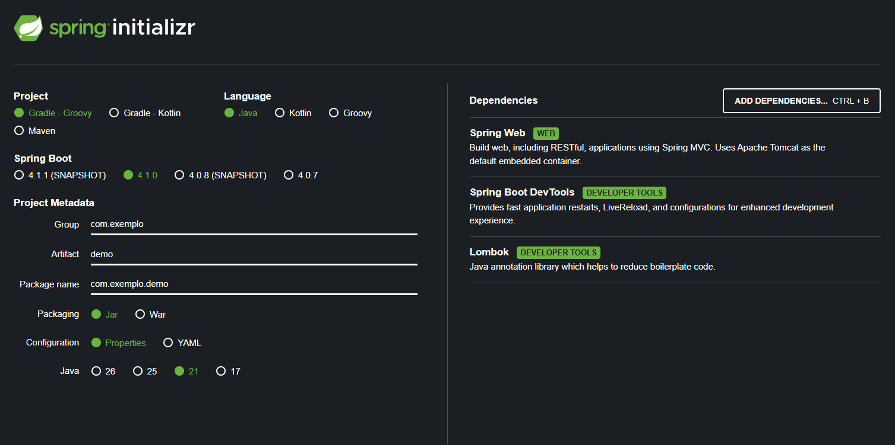

# Como Criar um Projeto Spring Boot com Java


Este guia ensina, passo a passo, como criar um projeto Spring Boot utilizando dois métodos:

1. **Spring Initializr** — ferramenta online para gerar a estrutura inicial do projeto
2. **IntelliJ IDEA** — criação do projeto diretamente pela IDE

---

## Sumário

- [1. O que é Spring Boot?](#1-o-que-é-spring-boot)
- [2. Método 1 — Spring Initializr](#2-método-1--spring-initializr)
  - [2.1 Configurando o projeto](#21-configurando-o-projeto)
  - [2.2 Adicionando dependências](#22-adicionando-dependências)
  - [2.3 Gerando e baixando o projeto](#23-gerando-e-baixando-o-projeto)
- [3. Método 2 — IntelliJ IDEA](#3-método-2--intellij-idea)
  - [3.1 Criando o projeto](#31-criando-o-projeto)
  - [3.2 Adicionando dependências pelo IntelliJ](#32-adicionando-dependências-pelo-intellij)
- [4. Estrutura básica do projeto](#4-estrutura-básica-do-projeto)
- [5. Executando a aplicação](#5-executando-a-aplicação)
- [6. Comparação dos dois métodos](#6-comparação-dos-dois-métodos)

---

## 1. O que é Spring Boot?

**Spring Boot** é um framework Java que facilita a criação de aplicações prontas para uso. Ele já vem configurado com tudo o que uma aplicação precisa para rodar, sem que você precise configurar tudo do zero.

Com o Spring Boot é possível criar:

- APIs REST
- Aplicações web
- Serviços de back-end

> A grande vantagem do Spring Boot é que ele reduz a quantidade de configuração necessária, permitindo que você foque no desenvolvimento das funcionalidades da sua aplicação.

---

## 2. Método 1 — Spring Initializr

O **Spring Initializr** é uma ferramenta online que gera automaticamente a estrutura inicial de um projeto Spring Boot. Você configura as opções desejadas e ele cria um arquivo `.zip` pronto para ser importado na sua IDE.

Acesse: [https://start.spring.io/](https://start.spring.io/)

---

### 2.1 Configurando o projeto

Ao acessar o Spring Initializr, você verá um formulário com as configurações do projeto. Preencha as opções conforme indicado abaixo:

| Campo            | Valor a selecionar  | O que significa                                                                 |
|------------------|---------------------|---------------------------------------------------------------------------------|
| **Project**      | `Gradle - Groovy`   | Sistema de build utilizado para compilar e gerenciar as dependências do projeto |
| **Language**     | `Java`              | Linguagem de programação utilizada no projeto                                   |
| **Spring Boot**  | `4.1.0`             | Versão do Spring Boot                                                           |
| **Group**        | `com.exemplo`       | Identificador do grupo/organização (usado como base do pacote)                  |
| **Artifact**     | `demo`              | Nome do projeto gerado                                                          |
| **Package name** | `com.exemplo.demo`  | Nome base do pacote Java (gerado automaticamente a partir do Group e Artifact)  |
| **Packaging**    | `Jar`               | Formato do arquivo gerado ao fazer o build da aplicação                         |
| **Java**         | `21`                | Versão do JDK utilizado no projeto                                              |

> **Dica:** O campo **Package name** é preenchido automaticamente com base no **Group** e no **Artifact**. Você pode alterá-lo manualmente se necessário.

---

### 2.2 Adicionando dependências

**Dependências** são bibliotecas externas que adicionam funcionalidades ao seu projeto. Em vez de escrever tudo do zero, você utiliza dependências já prontas que resolvem problemas comuns.

Por exemplo: a dependência **Spring Web** já entrega tudo o que é necessário para criar uma aplicação web ou API REST.

#### Passo a passo para adicionar uma dependência:

1. Clique no botão **"ADD DEPENDENCIES..."** (ou pressione `Ctrl + B`)
2. Na caixa de pesquisa, digite o nome da dependência desejada (ex: `Web`)
3. Clique sobre a dependência **Spring Web** para selecioná-la
4. Verifique se ela apareceu na seção **Dependencies** à direita da tela



> **Spring Web** — Permite desenvolver aplicações web e APIs REST utilizando o Spring MVC. Já inclui um servidor web embutido (Apache Tomcat), então você não precisa instalar nada separado para rodar a aplicação.

#### Configuração final com as dependências selecionadas:



Na imagem acima, as dependências selecionadas são:
- **Spring Web** — para criar aplicações web e APIs REST
- **Spring Boot DevTools** — reinicia automaticamente a aplicação ao detectar mudanças no código
- **Lombok** — biblioteca que reduz código repetitivo (getters, setters e construtores)

> Para esta aula, a dependência principal é o **Spring Web**. As demais são opcionais.

---

#### Adicionando dependências depois que o projeto foi criado

Caso você queira adicionar uma dependência **após** a criação do projeto, basta incluí-la manualmente no arquivo `build.gradle`, dentro do bloco `dependencies`:

```groovy
dependencies {
    implementation 'org.springframework.boot:spring-boot-starter-web'
}
```

Após editar o arquivo, o IntelliJ IDEA pedirá para recarregar as dependências do Gradle. Clique em **"Load Gradle Changes"** para aplicar.

---

### 2.3 Gerando e baixando o projeto

Após configurar o projeto e selecionar as dependências:

1. Revise todas as configurações e as dependências listadas à direita
2. Clique no botão **"GENERATE"** (ou pressione `Ctrl + Enter`)
3. Aguarde o download do arquivo `.zip`
4. Extraia o arquivo `.zip` em uma pasta de sua preferência
5. Abra o IntelliJ IDEA e importe o projeto extraído:
   - Vá em **File → Open...**
   - Navegue até a pasta onde você extraiu o projeto
   - Selecione a pasta raiz do projeto e clique em **OK**
6. Aguarde o IntelliJ carregar e baixar as dependências do Gradle

> O arquivo `.zip` gerado já contém toda a estrutura inicial do projeto Spring Boot, incluindo a classe principal, o arquivo de configuração e o `build.gradle`.

---

## 3. Método 2 — IntelliJ IDEA

O projeto Spring Boot também pode ser criado **diretamente pelo IntelliJ IDEA**, sem precisar acessar o navegador. O IntelliJ possui integração com o Spring Initializr, então o processo é bastante similar.

> **Observação:** As telas podem variar dependendo da versão do IntelliJ IDEA instalada. As instruções abaixo são compatíveis com versões recentes.

---

### 3.1 Criando o projeto

Siga os passos abaixo para criar um projeto Spring Boot pelo IntelliJ IDEA:

1. Abra o **IntelliJ IDEA**
2. Na tela inicial, clique em **"New Project"**
   - Se você já tiver um projeto aberto, vá em **File → New → Project...**
3. No painel esquerdo do assistente de criação, selecione **"Spring Boot"**
   - Caso essa opção não apareça, verifique se o plugin Spring está instalado em **File → Settings → Plugins**
4. Preencha as informações do projeto:
   - **Name:** `demo`
   - **Location:** escolha a pasta onde o projeto será salvo
   - **Language:** `Java`
   - **Type:** `Gradle - Groovy`
   - **Group:** `com.exemplo`
   - **Artifact:** `demo`
   - **Package name:** `com.exemplo.demo`
   - **JDK:** selecione o JDK 21 (ou a versão disponível no seu computador)
   - **Java:** `21`
   - **Packaging:** `Jar`
5. Clique em **"Next"** para avançar para a seleção de dependências

---

### 3.2 Adicionando dependências pelo IntelliJ

Na próxima tela, você poderá selecionar as dependências do projeto. O processo é semelhante ao Spring Initializr:

1. Na caixa de pesquisa, digite `Web`
2. Localize a dependência **Spring Web**
3. Marque a caixa ao lado de **Spring Web** para selecioná-la
4. Clique em **"Create"** para criar o projeto

O IntelliJ IDEA irá gerar a estrutura do projeto e começar a baixar as dependências do Gradle automaticamente. Aguarde esse processo ser concluído antes de executar a aplicação.

---

#### Dependências no arquivo build.gradle

Em projetos Gradle, todas as dependências ficam registradas no arquivo `build.gradle`. Após a criação do projeto, você pode abrir esse arquivo e verificar que as dependências selecionadas já estão listadas:

```groovy
dependencies {
    implementation 'org.springframework.boot:spring-boot-starter-web'
    testImplementation 'org.springframework.boot:spring-boot-starter-test'
}
```

---

## 4. Estrutura básica do projeto

Independente do método utilizado para criar o projeto, a estrutura de pastas gerada será semelhante à seguinte:

```
demo/
├── src/
│   ├── main/
│   │   ├── java/
│   │   │   └── com/
│   │   │       └── exemplo/
│   │   │           └── demo/
│   │   │               └── DemoApplication.java
│   │   └── resources/
│   │       └── application.properties
│   └── test/
│       └── java/
│           └── com/
│               └── exemplo/
│                   └── demo/
│                       └── DemoApplicationTests.java
├── build.gradle
└── settings.gradle
```

---

### Principais arquivos

#### `DemoApplication.java`

É a **classe principal** da aplicação. É ela que inicia o Spring Boot quando o projeto é executado.

```java
package com.exemplo.demo;

import org.springframework.boot.SpringApplication;
import org.springframework.boot.autoconfigure.SpringBootApplication;

@SpringBootApplication
public class DemoApplication {

    public static void main(String[] args) {
        SpringApplication.run(DemoApplication.class, args);
    }

}
```

- `@SpringBootApplication` — anotação que ativa as configurações automáticas do Spring Boot
- `SpringApplication.run(...)` — inicia a aplicação Spring Boot

---

#### `application.properties`

Arquivo utilizado para **configurar a aplicação**. Por padrão, ele começa vazio, mas pode ser usado para definir configurações como porta do servidor, nome da aplicação, conexão com banco de dados, entre outros.

```properties
# Porta em que a aplicação vai rodar (padrão é 8080)
server.port=8080

# Nome da aplicação
spring.application.name=demo
```

---

#### `build.gradle`

Arquivo utilizado pelo **Gradle** para configurar o projeto, suas dependências e como ele deve ser compilado.

```groovy
plugins {
    id 'org.springframework.boot' version '4.1.0'
    id 'io.spring.dependency-management' version '1.1.0'
    id 'java'
}

group = 'com.exemplo'
version = '0.0.1-SNAPSHOT'
sourceCompatibility = '21'

dependencies {
    implementation 'org.springframework.boot:spring-boot-starter-web'
    testImplementation 'org.springframework.boot:spring-boot-starter-test'
}
```

---

## 5. Executando a aplicação

Após criar e importar o projeto, siga os passos abaixo para executar a aplicação:

1. No painel do projeto (à esquerda), localize a classe principal **`DemoApplication.java`**
   - Ela fica em `src/main/java/com/exemplo/demo/`
2. Abra o arquivo clicando duas vezes sobre ele
3. Execute a aplicação de uma das formas abaixo:
   - Clique no ícone ▶️ (play) verde ao lado do método `main`
   - Clique com o botão direito sobre o arquivo e selecione **"Run 'DemoApplication'"**
   - Use o atalho `Shift + F10`
4. Acompanhe o console do IntelliJ para verificar se a aplicação iniciou corretamente

#### O que esperar no console

Quando a aplicação estiver pronta, você verá uma mensagem semelhante a:

```
Started DemoApplication in 2.345 seconds (process running for 2.789)
```

> Como o **Spring Web** está configurado, o Spring Boot inicia automaticamente um servidor web embutido (Tomcat). A aplicação ficará disponível para receber requisições enquanto estiver rodando.

---

## 6. Comparação dos dois métodos

Ambos os métodos têm o mesmo objetivo: **gerar a estrutura inicial de um projeto Spring Boot**. A diferença está na forma como essa criação é feita.

| Método                | Característica principal                                                         |
|-----------------------|----------------------------------------------------------------------------------|
| **Spring Initializr** | Cria o projeto através do navegador; o arquivo gerado é baixado e aberto na IDE |
| **IntelliJ IDEA**     | Permite criar e configurar o projeto diretamente pela IDE, sem sair do ambiente  |

- Use o **Spring Initializr** quando quiser uma visualização mais clara das opções ou quando estiver usando um editor sem integração direta com Spring.
- Use o **IntelliJ IDEA** quando quiser agilizar o processo sem sair da IDE.

---

> **Resumo:** Independente do método escolhido, ao final você terá um projeto Spring Boot funcional, com a estrutura de pastas correta, as dependências configuradas e pronto para o desenvolvimento.
